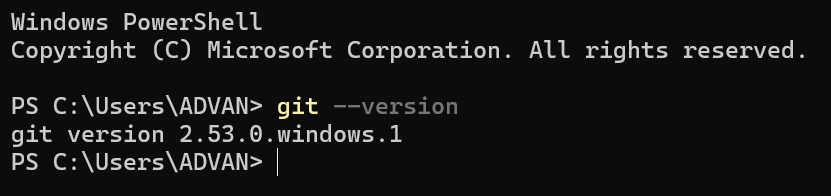
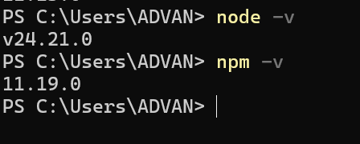
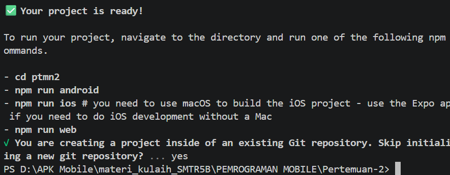
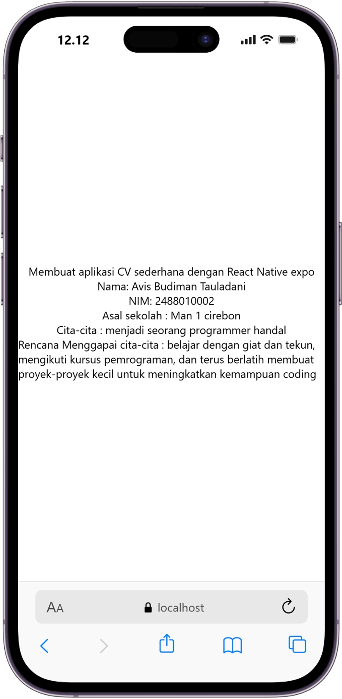

# Patikum menyiapkan lingkungan pengembangan dan memulai pemrograman mobile #

## Tujuan Pembelajaran ##
Mahasiswa mampu:
1. menyiapkan lingkungan pengembangan dan memulai pemrograman mobile
2. membuat aplikasi mobile dengan react native
3. meyelesaikan tugas CV sederhana dengan react native

## Materi dan laporan pratiikum ##
1. menyiapkan lingkungan pengembangan dan pemrograman mobile (react native)
- memastikan instalasi git bash
- cek instalasi git bash (git --version)
- bukti Verifikasi

-memastikan Node.Js dan NPM
- download dan instal Node.JS dan NPM di  https://nodejs.org/en/download
- konfirmasi node.js dan npm

2. membuat aplikasi / Project baru dengan react native framework Expo Go 
- buka dan baca dokumentasi resmi link 
- buka dan baca dokumentasi link 
- memulai membuat project baru 
- open terminal change directory ke pertemuan 2
- masukan perintah (npx create-expo-app-ptmn2 --temlplate blank)
- bukti Verivikasi

- running project 
 - cd ke ptmn2
  - npx expo start
  - install expo go di play store
  - bila juga mengunakan web emulator di laptop / pc
  - setelah berhentikan (ctrl + C)
  - install (npx expo install react-dom react-native-web)
  - npx expo start --web
  - Bukti Verifikasi
   
4. Tugas Praktikum
  - Membuat aplikasi CV sederhana dengan React Native
 -  Nama Lengkap
 -  NIM
 -  Asal Sekolah
 -  Cita-cita
 -  Rencana Menggapai cita-cita
 -  konfirmasi keberhasilan
 
  