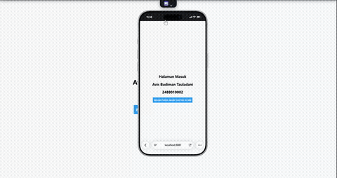

# Praktikum 4: React Native Navigation #

## Tujuan Pembelajaran ##
Mahasiswa mampu :
1. Merancang dan menerapkan navigasi antar layar (screen) pada aplikasi React Native.
2. Menggunakan library React Navigation (Stack Navigator, Tab Navigator, Drawer Navigator).

## Alur Praktikum ##

### Langkah 1: Inisialisasi Proyek React Native ###
1. Buka terminal atau command prompt
2. Uban directory ke folder Pertemuan 4 (co "Pemrograman Mobile\Pertemuan-4")
3. Buat proyek baru menggunakan perintah berikut : npx create-expo-app ptn4 --template blank
4. Masuk ke dalam folder proyek menggunakan perintah berikut : cd ptn4
5. Install core navigation library (npm install @react-navigation/native)
6. Install dependensi pendukung (wajib untuk Expo) npx expo install react-native-screens react-native-safe-area-context react-native-gesture-handler react-native-reanimated



### Langkah 2: Membuat Stack Navigator ###
1. Instalasi Pustaka Stack : npm install @react-navigation/native-stack
2. Buat Folder didalam proyek dengan nama screens
3. Didalam folder screens buat 2 file dengan nama Login.js dan Signup.js
4. Masukan Kode sesuai pada Modul Praktikum 4
5. sesuaikan file App.js dengan kode yang ada pada modul.
6. Simpan dan Install depedensi untuk web "npx expo install react-dom react-native-web"
7. Jalankan Perintah npx expo start --web
8. Konfirmasi Bukti


### Langkah 3: Stack Navigation ###

### Langkah 1: Instalasi Pustaka Drawer

```sh
npm install @react-navigation/drawer
# Pastikan juga plugin reanimated sudah terinstall dan dikonfigurasi di babel.config.js jika diperlukan
```
### Langkah 2: Konfigurasi Drawer di `App.js`

Ubah kembali file `App.js` untuk mencoba Drawer Navigation menggunakan layar Home dan Profile yang sudah dibuat sebelumnya:

```js
import React from 'react';
import { NavigationContainer } from '@react-navigation/native';
import { createDrawerNavigator } from '@react-navigation/drawer';

import HomeScreen from './screens/HomeScreen';
import ProfileScreen from './screens/ProfileScreen';

const Drawer = createDrawerNavigator();

export default function App() {
  return (
    <NavigationContainer>
      <Drawer.Navigator initialRouteName="Home">
        <Drawer.Screen name="Home" component={HomeScreen} options={{ drawerLabel: 'Beranda' }} />
        <Drawer.Screen name="Profile" component={ProfileScreen} options={{ drawerLabel: 'Profil Pengguna' }} />
      </Drawer.Navigator>
    </NavigationContainer>
  );
}
```

.gif>)
