# Laporan Praktikum  

## 📝 LANGKAH 1 — Import & Struktur Dasar ##

1. buka file App.js yanag ada di folder projek ptmn-2
2. immport Library dan Commponent yang diperlihatkan 
3. Konfirmasi Bukti 

 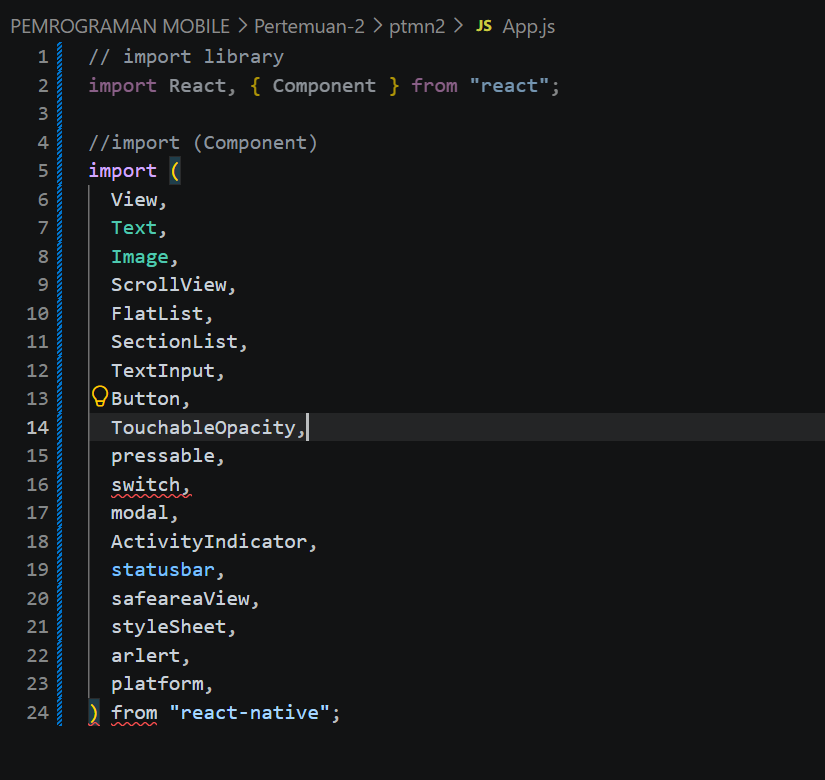

## L📝 LANGKAH 2 — Menyiapkan Data (Objek & Array) ##

...
1. Buat Objek Array bernama PROFILE untuk wadah data profile
2. Masukan Data yang diperlukan
3. Konfirmasi Bukti
...

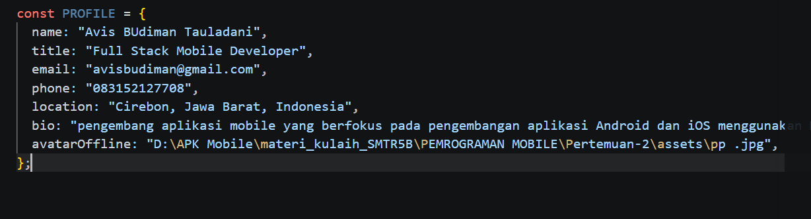

// ============================================ // DATA SKILLS (array of objects) // → Akan ditampilkan dengan FlatList // ============================================

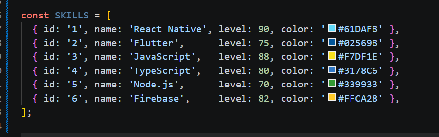" width = "60%" >

// ============================================ // DATA RIWAYAT (sections) // → Akan ditampilkan dengan SectionList // ============================================

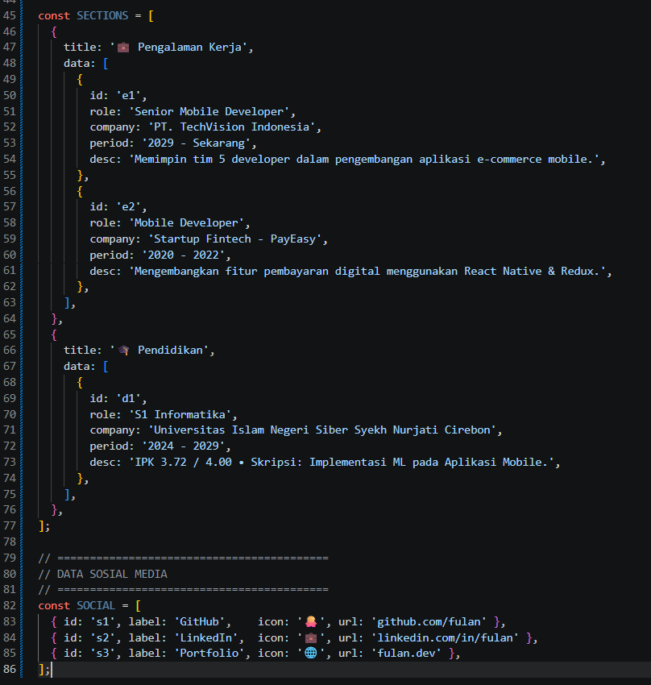" width = "60%" >

## 📝 LANGKAH 3 — Sub-Components (SkillCard & TimelineCard) ##
Konsep: Komponen kecil yang bertugas merender satu item list. Ini adalah praktik component reuse.

Tambahkan kode berikut di antara data dan fungsi App():

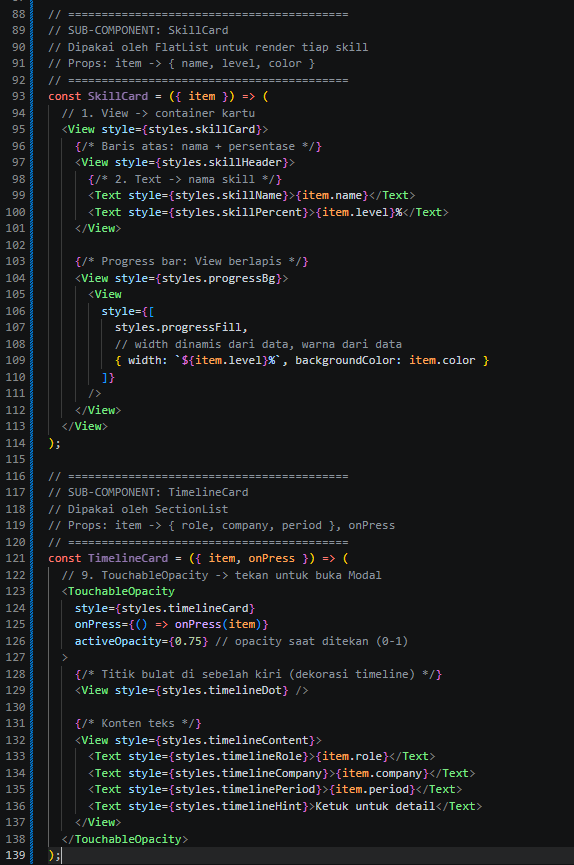" width = "60%" >

## 📝 LANGKAH 4 — State Management dengan useState ##
Konsep: useState menyimpan data yang bisa berubah. Setiap perubahan state akan men-trigger re-render komponen.

Tambahkan state di dalam fungsi App():

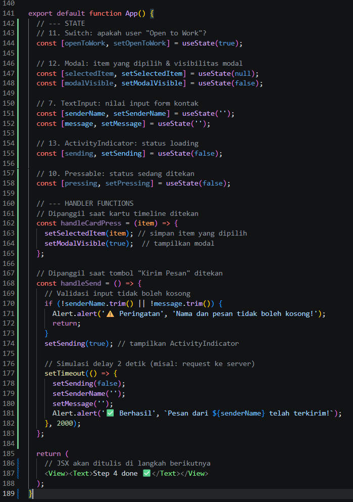" width = "60%" > 

## 📝 LANGKAH 5 — SafeAreaView, StatusBar & Header ##
Konsep:

- SafeAreaView → memastikan konten tidak tertutup notch (takik kamera) atau home indicator
- StatusBar → mengatur tampilan bar di bagian atas perangkat
- View + Switch → membangun header bar

Ganti bagian return (...) di App():

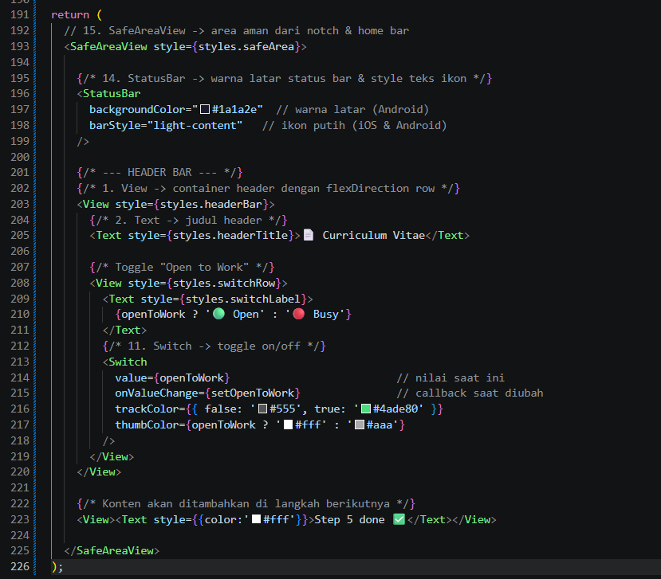

## 📝 LANGKAH 6 — ScrollView & Profil Section (View, Text, img/image) ##
Konsep:

ScrollView → membungkus konten panjang agar bisa di-scroll
img/image → menampilkan gambar dari URL (source={{ uri: '...' }})
Text → bisa di-styling dengan style prop seperti CSS
Ganti <View><Text ...>Step 5</Text></View> dengan:

{/* 4. ScrollView → semua konten CV dibungkus di sini */}

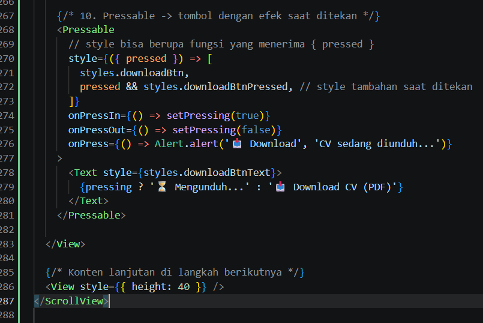

## 📝 LANGKAH 7 — FlatList (Daftar Skills) ##
Konsep: FlatList dioptimalkan untuk menampilkan daftar panjang — hanya item yang terlihat di layar yang di-render (lazy rendering / windowing).

Tambahkan kode berikut di dalam <ScrollView>, setelah section profil:

{/* ════════════════════════════════════ SECTION SKILLS Komponen: FlatList ════════════════════════════════════ */}
 
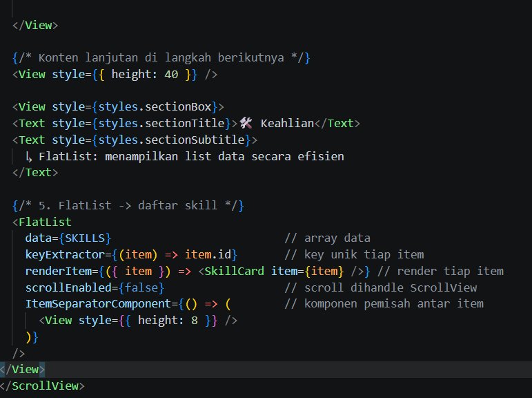

## 📝 LANGKAH 8 — SectionList (Pengalaman & Pendidikan) ##
Konsep: SectionList seperti FlatList tetapi bisa mengelompokkan data berdasarkan section/kategori. Membutuhkan prop sections (bukan data) yang berisi array objek { title, data }.

{/* ════════════════════════════════════ SECTION RIWAYAT Komponen: SectionList ════════════════════════════════════ */}

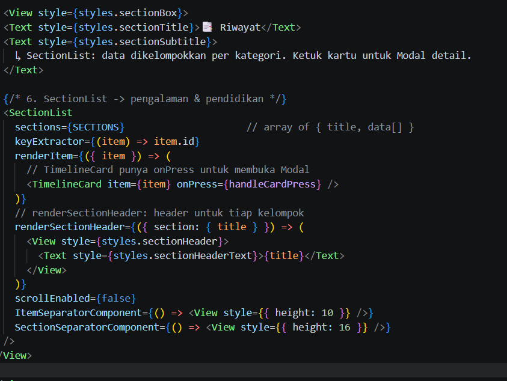

📝 LANGKAH 9 — TextInput, Button & ActivityIndicator
Konsep:

TextInput → input teks. value + onChangeText = controlled component
Button → tombol paling sederhana di React Native
ActivityIndicator → spinner loading
{/* ════════════════════════════════════ SECTION FORM KONTAK Komponen: TextInput, Button, ActivityIndicator ════════════════════════════════════ */}

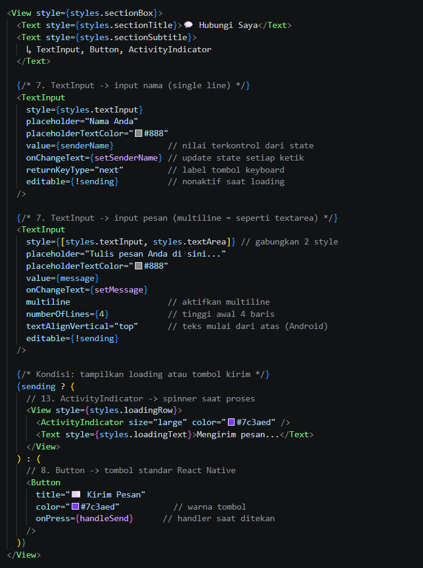

📝 LANGKAH 10 — Modal (Popup Detail)
Konsep: Modal menampilkan konten di atas (overlay) tampilan saat ini. Dikendalikan dengan prop visible.

Tambahkan setelah penutup </ScrollView> dan sebelum </SafeAreaView>:

{/* ════════════════════════════════════ 12. MODAL → popup detail riwayat ════════════════════════════════════ */}

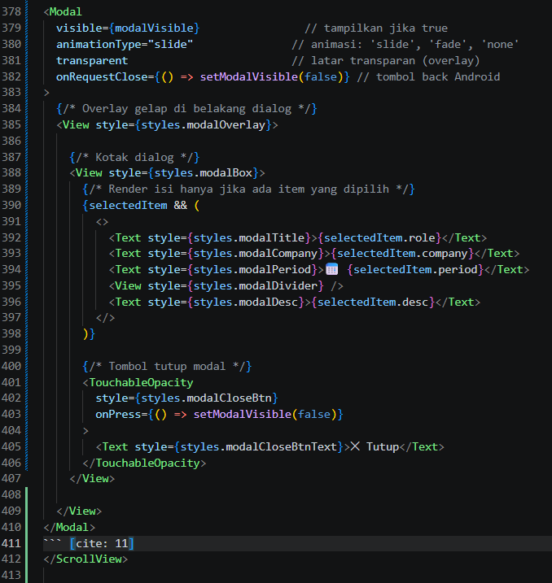

## 📝 LANGKAH 11 — StyleSheet (Styling Terpusat) ##
Konsep: StyleSheet.create() adalah cara resmi styling di React Native. Mirip CSS tetapi menggunakan JavaScript object dengan properti camelCase.

Tambahkan kode berikut di bawah fungsi App() (paling bawah file):

// ============================================ // PALET WARNA (konstanta warna terpusat) // ============================================

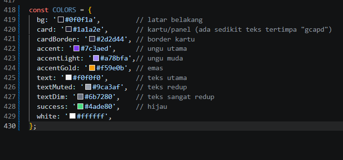

## ✅ LANGKAH 12 — Verifikasi & Pengujian ##

Jalankan aplikasi dan pastikan semua fitur bekerja:

| # | Yang Diuji | Hasil yang Diharapkan |
|---|---|---|
| 1 | Aplikasi bisa dibuka | Layar CV tampil tanpa error ✅|
| 2 | Foto profil tampil | Gambar dari URL terload ✅|
| 3 | Halaman bisa di-scroll | Semua section bisa diakses ✅|
| 4 | Toggle Switch | Badge "Open to Work" muncul/hilang ✅|
| 5 | Progress bar skill | Bar berwarna sesuai persentase ✅|
| 6 | Ketuk kartu riwayat | Modal popup muncul dari bawah ✅|
| 7 | Tombol Tutup di Modal | Modal tertutup ✅|
| 8 | Isi form & kirim | Loading 2 detik → Alert sukses ✅|
| 9 | Kirim dengan input kosong | Alert peringatan muncul ✅|
| 10 | Tekan Download CV | Efek visual berubah + Alert ✅|
| 11 | Tap tombol sosmed | Alert URL muncul ✅|

## DOKUMENTASI TUGAS APP WEB ##
D:\APK Mobile\materi_kulaih_SMTR5B\PEMROGRAMAN MOBILE\Petemuan-3\dokumentasi_app_mobile.mp4